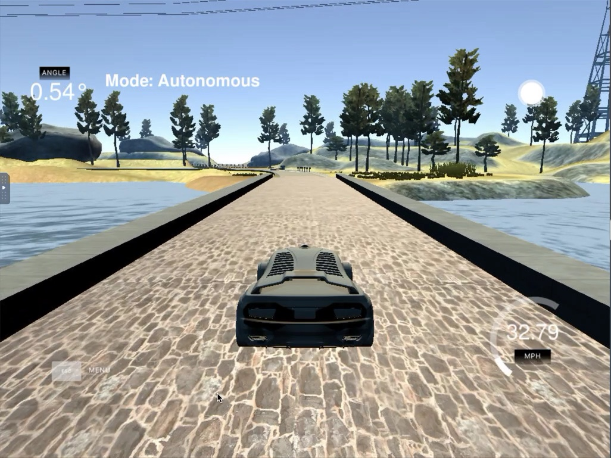

# **PID Controller**

## Writeup by Matthew Jones

### Project: CarND-PID-Control

---

**PID Controller Project**

The major steps taken to complete this project included:
* Reviewing **PID Controller** project instructions and previous **Behavior Cloning** project
* Getting familiar with the commands needed in the Udacity workspace to compile project code and launch the driving simulator
* Writing my code in __main.cpp__ and __PID.cpp__ to enable my car to drive around the track  
* Adapting my code to ensure that my car does not violate any of the requirements defined in the [project rubric](https://review.udacity.com/#!/rubrics/1972/view)
* Describing the effects of the P,I,D components in my implementation and how final hyper-parameters were chosen **_[see below](#Reflection)_**

[//]: # (Image References)
__Screenshot and Video from the driving simulator__  

[download video](https://github.com/matttpj/CarND-PID-Control/pid_control_success.mp4)

---
### Writeup / README
Here is a link to my [project code](https://github.com/matttpj/CarND-PID-Control)  

---
### Files Submitted

#### Submission includes all files required to run my car in the driving simulator

Key files are in source directory __src/*__:
 * Connects to the simulator and initiates PID control: __main.cpp__   
 * Class file for the PID controller class and error calculating methods: __PID.cpp__
 * Header file for the PID controller class: __pid.h__
 * Manipulate JSON format data structures and messages:  __json.hpp__

---
### Compilation
The above source code compiles successfully in the Udacity workspace.

---
### Implementation
| Criteria       		|     Specification	        					|    Status  |
|:---------------------:|:-------------------------------:|:--------:|
| The PID procedure follows what was taught in the lessons. 	| It's encouraged to be creative, particularly around hyperparameter tuning/optimization. However, the base algorithm should follow what's presented in the lessons.	|  PASS |

---
### Reflection
The code for Path Planning and Generating Paths is included in file **_main.cpp_** from **line XX** onwards. An explanation of how the code works is provided below.  **TO DO**

| Criteria       		|     Specification	        					|    Status  |
|:---------------------:|:-------------------------------:|:--------:|
| Describe the effect each of the P, I, D components had in your implementation. 	| Student describes the effect of the P, I, D component of the PID algorithm in their implementation. Is it what you expected? Visual aids are encouraged, i.e. record of a small video of the car in the simulator and describe what each component is set to.	|  PASS |
| Describe how the final hyperparameters were chosen. | Student discusses how they chose the final hyperparameters (P, I, D coefficients). This could be have been done through manual tuning, twiddle, SGD, or something else, or a combination!	|  PASS |

__Localization [line 79](https://github.com/matttpj/CarND-Path-Planning/blob/master/src/main.cpp#L79) >>__ The simulator provides information about position of my car on the track, including: x, y, s, d, theta, yaw, speed.

### Simulation
| Criteria       		|     Specification	        					|    Status  |
|:---------------------:|:-------------------------------:|:--------:|
| The vehicle must successfully drive a lap around the track.	| No tire may leave the drivable portion of the track surface. The car may not pop up onto ledges or roll over any surfaces that would otherwise be considered unsafe (if humans were in the vehicle). |  PASS |
